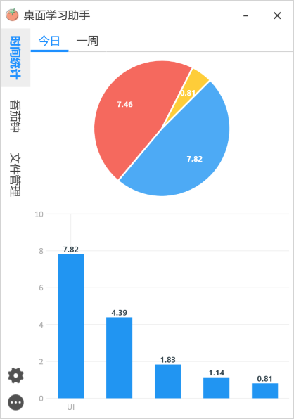
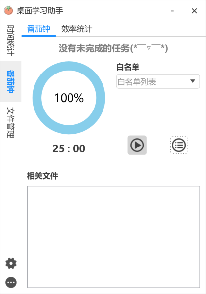
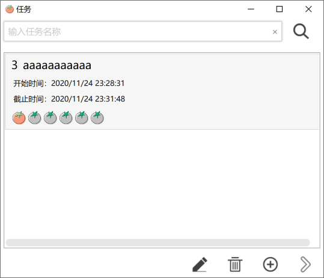
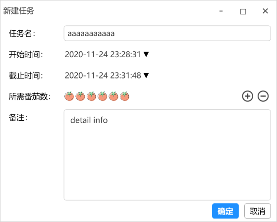
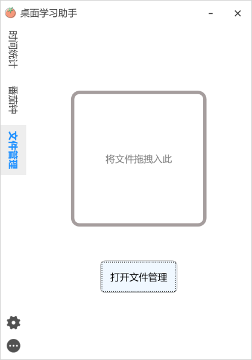
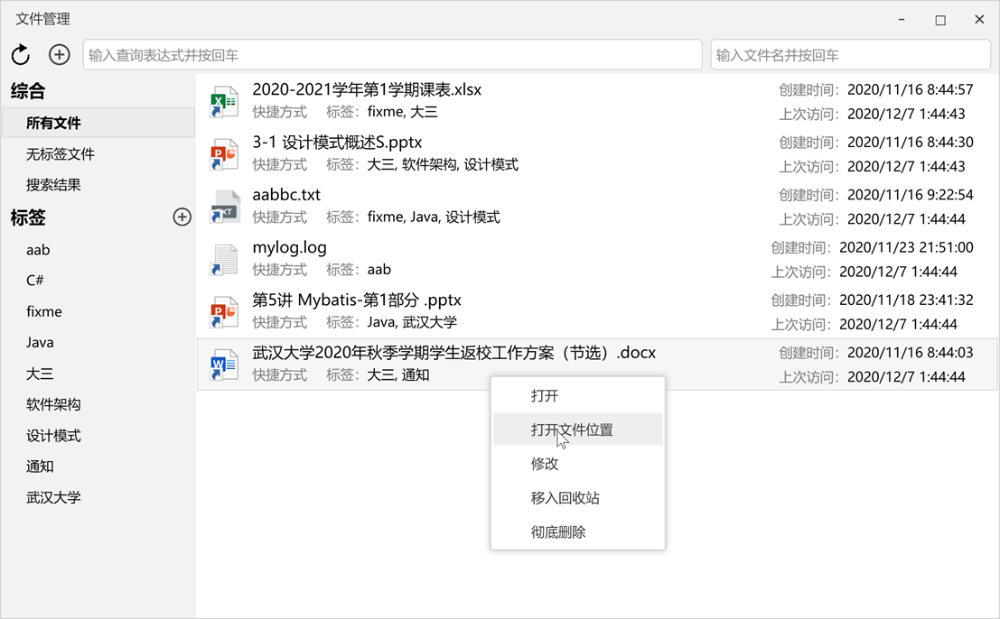
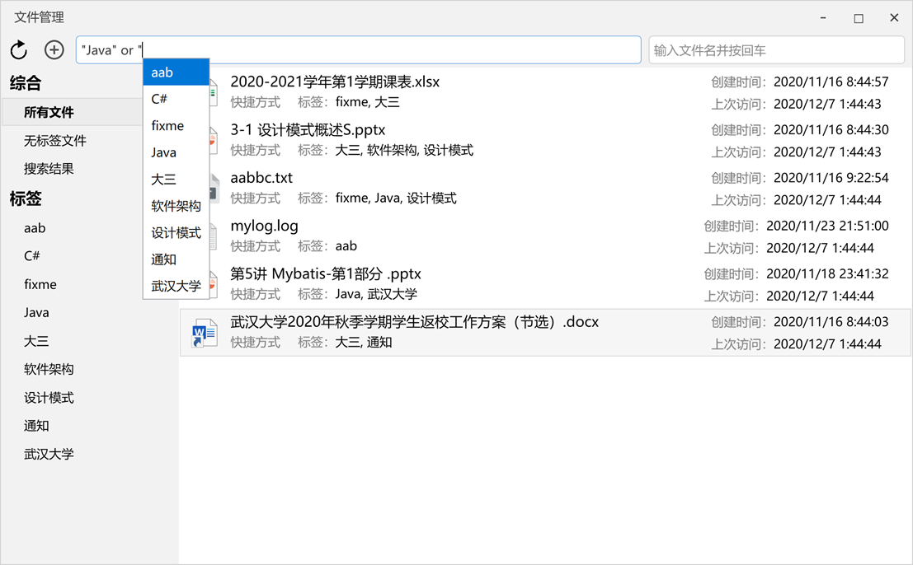
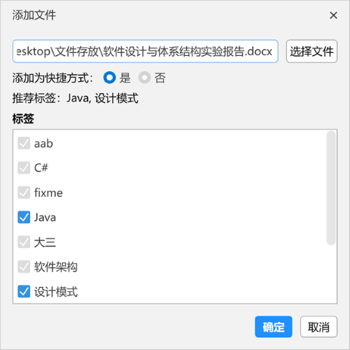
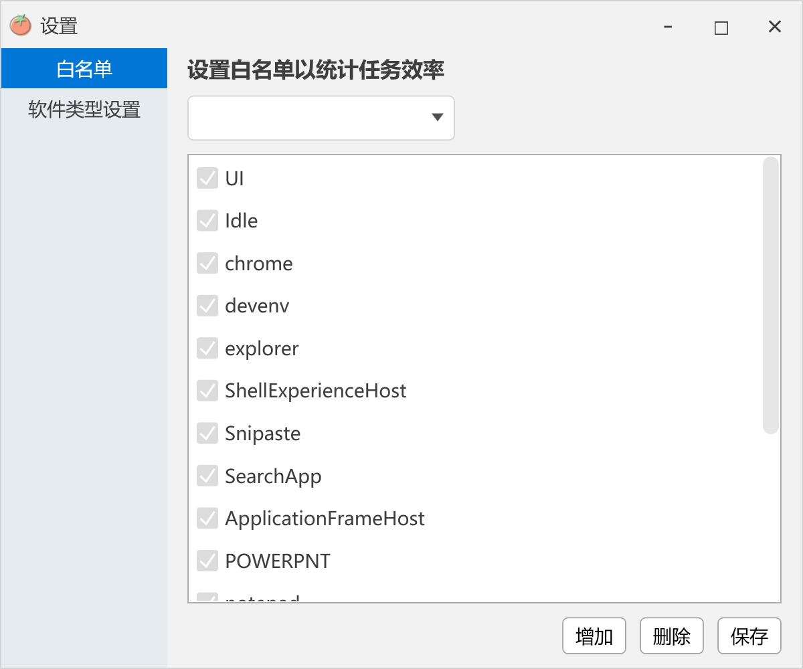

# Desktop Learning Assistant 桌面学习助手

.Net 架构程序设计大作业

## 主要功能

1. 统计屏幕使用时间
2. 番茄工作法
3. 标签文件管理

## 小组分工

| 人员   | 工作                                          |
| ------ | --------------------------------------------- |
| 邹龙威 | 屏幕使用时间统计模块、配置模块、选题报告、PPT |
| 朱华彬 | 标签文件管理模块、UI 界面：文件管理相关窗口   |
| 付美偲 | 任务管理模块、需求与设计文档                  |
| 龙晓怡 | UI 界面：任务管理 & 番茄钟相关窗口            |
| 张梦萱 | UI 界面：屏幕时间统计相关窗口、其他窗口       |

## 项目文档

1. [选题报告](./doc/选题报告.docx)
2. [需求与设计文档](./doc/需求与设计文档.docx)
3. [结项PPT](./doc/DJ-Team.pptx)

## 应用截图
### 屏幕时间统计

### 番茄钟

### 标签文件管理

### 设置

