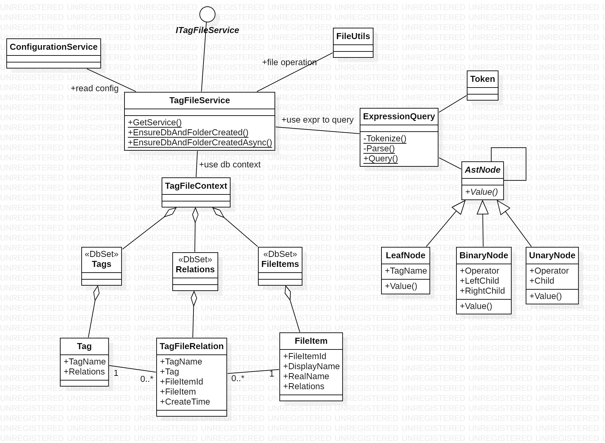

- [概述](#概述)
  - [命名空间](#命名空间)
  - [类](#类)
  - [扩展方法](#扩展方法)
  - [异步操作](#异步操作)
  - [图](#图)
    - [实体类 E-R 图](#实体类-e-r-图)
    - [UML 图](#uml-图)
- [注意事项](#注意事项)
- [TagFileRelation](#tagfilerelation)
  - [属性](#属性)
    - [TagName](#tagname)
    - [Tag](#tag)
    - [FileItemId](#fileitemid)
    - [FileItem](#fileitem)
    - [UtcCreateTime](#utccreatetime)
    - [LocalCreateTime](#localcreatetime)
- [Tag](#tag-1)
  - [属性](#属性-1)
    - [TagName](#tagname-1)
    - [Relations](#relations)
  - [扩展方法](#扩展方法-1)
    - [RenameAsync](#renameasync)
    - [AddFileAsync](#addfileasync)
    - [RemoveFileAsync](#removefileasync)
- [FileItem](#fileitem-1)
  - [属性](#属性-2)
    - [FileItemId](#fileitemid-1)
    - [DisplayName](#displayname)
    - [RealName](#realname)
    - [Relations](#relations-1)
  - [扩展方法](#扩展方法-2)
    - [AddTagAsync](#addtagasync)
    - [RemoveTagAsync](#removetagasync)
    - [RealPath](#realpath)
    - [Open](#open)
    - [ShowInExplorer](#showinexplorer)
    - [RenameAsync](#renameasync-1)
    - [DeleteAsync](#deleteasync)
    - [DeleteToRecycleBinAsync](#deletetorecyclebinasync)
- [TagFileService](#tagfileservice)
  - [静态方法](#静态方法)
    - [GetService](#getservice)
    - [EnsureDbAndFolderCreated](#ensuredbandfoldercreated)
    - [EnsureDbAndFolderCreatedAsync](#ensuredbandfoldercreatedasync)
- [ITagFileService](#itagfileservice)
  - [成员方法](#成员方法)
    - [GetTagAsync](#gettagasync)
    - [AddTagAsync](#addtagasync-1)
    - [RemoveTagAsync](#removetagasync-1)
    - [RenameTagAsync](#renametagasync)
    - [IsTagExistAsync](#istagexistasync)
    - [TagListAsync](#taglistasync)
    - [GetRelationAsync](#getrelationasync)
    - [AddRelationAsync](#addrelationasync)
    - [RemoveRelationAsync](#removerelationasync)
    - [IsRelationExistAsync](#isrelationexistasync)
    - [RelationListAsync](#relationlistasync)
    - [GetFileItemAsync](#getfileitemasync)
    - [AddShortcutToRepoAsync](#addshortcuttorepoasync)
    - [MoveFileToRepoAsync](#movefiletorepoasync)
    - [GetRealFilepath](#getrealfilepath)
    - [DeleteFileAsync](#deletefileasync)
    - [DeleteFileToRecycleBinAsync](#deletefiletorecyclebinasync)
    - [RenameFileItemAsync](#renamefileitemasync)
    - [FileItemListAsync](#fileitemlistasync)
    - [QueryAsync](#queryasync)
    - [FilesWithoutTagAsync](#fileswithouttagasync)
- [InvalidExpressionException](#invalidexpressionexception)
- [查询表达式](#查询表达式)
  - [语法](#语法)
  - [示例](#示例)

# 概述
## 命名空间
只需要引入以下两个命名空间：

1. DesktopLearningAssistant.TagFile
    - ITagFileService 接口
    - TagFileService 类
    - InvalidExpressionException 类
1. DesktopLearningAssistant.TagFile.Model
    - Tag 类
    - FileItem 类
    - TagFileRelation 类

其他命名空间中的内容与实现相关，无视即可。

## 类
只需要使用以下几个类：

1. ITagFileService
1. TagFileService
1. Tag
1. FileItem
1. TagFileRelation
1. InvalidExpressionException

其他类与实现相关，只是为了方便测试才写成 public，无视即可。

采用外观模式，所有操作都通过 TagFileService 类完成。

## 扩展方法
所有操作都是通过调用 TagFileService 的成员方法完成的。不过，为了方便调用者编写代码，又为 Tag 和 FileItem 实体类定义了一些扩展方法，可以像调用成员方法一样调用它们。

引入命名空间 DesktopLearningAssistant.TagFile 即可使用这些扩展方法。

## 异步操作
名字带 Async 后缀的方法都是异步方法，关于 C# 中的异步编程参见 [C# 中的异步编程](https://docs.microsoft.com/zh-cn/dotnet/csharp/programming-guide/concepts/async/)。

## 图
### 实体类 E-R 图


### UML 图


# 注意事项
**不要**直接修改实体类的属性，若要执行重命名、打标签等操作，请使用实体类的扩展方法，或使用 ITagFileService 的成员方法。

执行了重命名标签、删除标签等操作后，含有该标签的 FileItem 的 Relations 属性会发生变化。请刷新你的 View Model，否则可能出现数据不一致的情况。

# TagFileRelation
表示“标签-文件”关系的实体类。“标签-文件”为多对多关系。

## 属性
### TagName
标签的名字，外键。

### Tag
对应的 Tag 对象。

### FileItemId
FileItem 的 Id，外键。

### FileItem
对应的 FileItem 对象。

### UtcCreateTime
标签被打上的时间。注意这个是 UTC 时间，要获取本地时间请使用 LocalCreateTime 属性。

### LocalCreateTime
标签被打上的时间，是本地时间。

# Tag
表示标签的实体类。

## 属性
### TagName
标签的名字，主键。

### Relations
含有该标签的 TagFileRelation 的集合。

可通过 Relations 属性获取所有含该标签的文件。

## 扩展方法
### RenameAsync
重命名该 Tag。

若新名字的 Tag 已经存在，则什么都不做并返回 false。

### AddFileAsync
为该 Tag 增加一个文件。

若文件已带有该 Tag，则什么都不做。

### RemoveFileAsync
为 Tag 移除文件。

若该文件不含该 Tag，则什么都不做。

# FileItem
表示文件的实体类。

## 属性
### FileItemId
文件的唯一标识，主键。

### DisplayName
要显示的文件名。

应使用 DisplayName 属性作为在用户界面上显示的文件名。

调用 FileItem 的 Rename 方法时，修改的也是 DisplayName。

### RealName
实际的文件名。

FileItem 的 RealName 由 Service 类自行维护，请不要手动修改它。

如果要获取文件的路径，调用 RealPath 方法即可。

### Relations
含有该文件的 TagFileRelation 的集合。

可通过 Relations 属性获取该文件的所有标签。

## 扩展方法
### AddTagAsync
为 FileItem 增加一个标签。

若 FileItem 已包含该标签，则什么都不做。

### RemoveTagAsync
移除 FileItem 的某个标签。

若 FileItem 不含该标签，则什么都不做。

### RealPath
获取文件的真实路径。

### Open
使用默认程序打开文件。

### ShowInExplorer
在“资源管理器”中显示该文件。

### RenameAsync
重命名文件。

注意：该方法不会检查文件名是否合法。

### DeleteAsync
删除文件。

### DeleteToRecycleBinAsync
把文件放入回收站。

# TagFileService
`TagFileService` 实现了 `ITagFileService` 接口。

`TagFileService` 是一个单例类，应通过静态方法 `GetService` 获取单例对象。

除了 `GetService` 外，其他方法均不保证线程安全性。

## 静态方法
### GetService
获取单例对象，返回类型为 `ITagFileService`。

```cs
ITagFileService service = TagFileService.GetServcie();
```

### EnsureDbAndFolderCreated
确保数据库和仓库文件夹已创建。该方法应在应用程序启动时调用，因为这可能是用户第一次打开软件，数据库和文件夹都还不存在。

### EnsureDbAndFolderCreatedAsync
上面那个方法的异步版本。

# ITagFileService
## 成员方法
注：调用 `ITagFileService` 的 `RenameTagAsync` 方法与调用 `Tag` 的 `RenameAsync` 方法效果是相同的。其他类似情况依此类推。

### GetTagAsync
按 TagName 获取 Tag，不存在则返回 null。

### AddTagAsync
将新 Tag 加入系统中，并返回添加的 Tag 对象。

若该名字的 Tag 已存在，则什么都不做。

### RemoveTagAsync
将该 Tag 从系统中移除。

若 Tag 不存在，则什么都不做。

### RenameTagAsync
重命名该 Tag。

若新名字的 Tag 已经存在，则什么都不做并返回 false。

### IsTagExistAsync
该名字的 Tag 是否存在。

### TagListAsync
获取含所有 Tag 的 List。

### GetRelationAsync
获取 TagFileRelation 对象。不存在则返回 null。

### AddRelationAsync
插入一个新的 Tag-FileItem 关系，并返回实体类对象。

若关系已存在，则什么都不做。

### RemoveRelationAsync
移除某个 Tag-FileItem 关系。

若该关系不存在，则什么都不做。

### IsRelationExistAsync
查询关系是否存在。

### RelationListAsync
获取含所有关系的列表。

### GetFileItemAsync
按 FileItemId 获取 FileItem。

### AddShortcutToRepoAsync
将文件以快捷方式的形式加入仓库。

### MoveFileToRepoAsync
将文件移动到仓库中。

### GetRealFilepath
获取文件在仓库内的真实路径。

### DeleteFileAsync
删除文件。

### DeleteFileToRecycleBinAsync
将文件移动到回收站。

### RenameFileItemAsync
重命名文件。

### FileItemListAsync
获取含所有 FileItem 的列表。

### QueryAsync
表达式查询。

### FilesWithoutTagAsync
获取不含任何标签的文件。

# InvalidExpressionException
可能在执行 `ITagFileService.Query` 时抛出，表示查询表达式非法。

继承自 ApplicationException。

# 查询表达式
怎么设计一个友好且易用的图形界面是个问题。反正就是要把用户的操作转换成如下的表达式用于查询。

## 语法
1. 支持 `and`、`or`、`not` 和括号运算符。运算符优先级为：`not > and > or`。
1. 标签名要用双引号括起来。
1. 若标签名中含有 `"` 或 `\` 字符，需要用 `\` 转义。
1. 标签名和运算符之间的空格可以有也可以没有。

## 示例
查询同时含“大二”和“数据结构”的文件：`"大二" and "数据结构"`

查询含“算法”或“数据结构”的文件：`"算法" or "数据结构"`

查询含“大二”或“大三”但不含“实验课”的文件：`("大二" or "大三") and not "实验课"`
