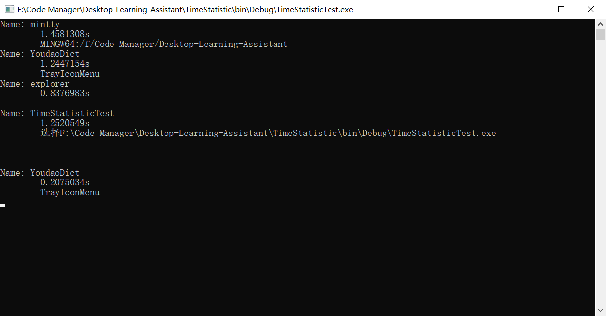

## 代码示例

下面这段代码提供了一个调用屏幕时间统计服务的样例（也是TimeStatisticTest项目中的测试代码）。看完代码后，您还需要阅读本文档后面部分的说明，尤其是**基本逻辑**，以详细了解该模块的工作原理。

```C#
ActivityMonitor monitor = ActivityMonitor.GetMonitor();
monitor.Start();
TimeStatisticService timeStatisticService = TimeStatisticService.GetTimeStatisticService();
while (true)
{
    DateTime beginTime = DateTime.Now - TimeSpan.FromSeconds(5);
    DateTime endTime = DateTime.Now;

    List<UserActivity> userActivities = timeStatisticService.GetUserActivitiesWithin(beginTime, endTime);   // 获取最近五秒的活动统计
    // List<UserActivity> userActivities = timeStatisticService.GetAllUserActivities();        // 获取所有的活动统计
    Console.Clear();
    foreach (UserActivity userActivity in userActivities)	// 打印屏幕使用时间统计
    {
        Console.WriteLine(userActivity.ToString());
    }
    Console.WriteLine("\n————————————————————\n");
    List<UserActivity> killedActivities = timeStatisticService.GetKilledUserActivities();
    foreach (UserActivity killedActivity in killedActivities)	// 打印关闭的软件统计
    {
        Console.WriteLine(killedActivity.ToString());
    }
    Thread.Sleep(1000);
}
```

运行结果：




## 命名空间

在使用屏幕使用时间统计的服务前，需要引入以下两个命名空间：

1. DesktopLearningAssistant.TimeStatistic.Model
   - UserActivity类
   - UserActivityPiece类
2. DesktopLearningAssistant.TimeStatistic
   - ITimeStatisticService类
   - TimeStatisticService类
   - TimeDataManager类
   - ActivityMonitor类

您需要关注的只有Model中的两个类和TimeStatisticService、ActivityMonitor两个类

## 类的说明

每个类的各个变量、属性和方法的说明已经用注释的方式写在了代码中，所以在此仅简单说明每个类的作用和联系。

### 基本逻辑

我们将用户在屏幕中使用的最顶层的窗口作为用户当前的活动片。当用户切换了顶层窗口时，当前活动片会被压入列表中，然后更新为新的活动片。

经过一段时间的监控，我们就能获得一系列活动片。若要获取某段时间内用户使用了哪些软件及其时间，只要将这段时间内的活动片提取出来，将属于相同软件的活动片聚合起来，即可获得一系列活动。每个活动对应一款软件，且附有使用时间。

### UserActivityPiece

用户活动片，详细含义已在基本逻辑中说明。

### UserActivity

用户活动，对应一款软件，详细含义已在基本逻辑中说明。

### ITimeStatisticService

服务类的接口，抽象了所有服务类提供的服务。**在使用前建议仔细阅读此类**。

### TimeStatisticService

服务类，单例类。在使用时通过GetTimeStatisticService方法获得单例对象，然后通过接口的方法查询统计结果。

### TimeDataManager

数据管理类，单例类。您不需要关心此类，因为这个类仅为TimeStatisticService和ActivityMonitor类提供数据管理服务。

### ActivityMonitor

监控类，单例类。在使用服务类之前，**您需要在程序启动的位置通过GetActivityMonitor方法获得单例对象，然后通过Start方法启动监控线程。**如果没有启动，那么服务类将查询不到数据。